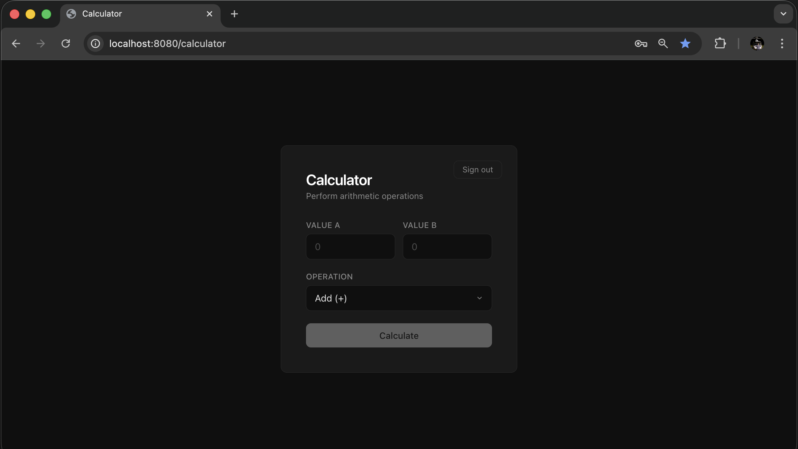
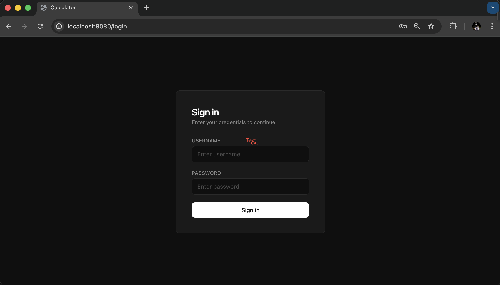

# Full-Stack Calculator

> **This entire application — every line of code, every test, every config file, every piece of documentation — was autonomously built by a swarm of AI coding agents. No human wrote a single line of code.**

A production-grade full-stack calculator with JWT authentication, React frontend, Spring Boot backend, PostgreSQL persistence, comprehensive test coverage, and Docker deployment — created from an empty directory in **28 minutes** at a cost of **$1.45 USD**.

<p align="center">
  
</p>

---

**Built by [Dmitry Kislov](https://www.linkedin.com/in/dmitrykislov/)** | Autonomous Agent Swarm Architecture

---

## Why This Is Impressive

This isn't a toy demo — it's a **complete, production-ready application** with JWT authentication, a React frontend, a Spring Boot backend, PostgreSQL persistence, Testcontainers integration tests, multi-stage Docker builds, and comprehensive documentation. **Every line of code, every test, every config file was written by AI agents working autonomously.**

### AI Agents vs. Senior Software Engineer

A senior software engineer building this from scratch would need to:

| Work Item | Estimated Human Time |
| --- | --- |
| Requirements analysis and task breakdown | 2-4 hours |
| Project scaffolding (Maven, React/Vite, TypeScript config) | 1-2 hours |
| Core business logic + unit tests (Calculator, Adder, history tracking) | 2-3 hours |
| Spring Boot REST API setup + integration tests | 2-3 hours |
| Spring Security + JWT authentication flow + auth tests | 3-4 hours |
| React UI (Login + Calculator pages, RTK Query, routing) | 3-4 hours |
| Frontend tests (Vitest, React Testing Library) | 1-2 hours |
| PostgreSQL integration (JPA entities, repositories, Hibernate DDL) | 1-2 hours |
| Testcontainers-based database tests | 1-2 hours |
| Full-stack integration test (login -> calculate -> verify DB) | 1-2 hours |
| Multi-stage Dockerfile + Docker Compose + healthchecks | 1-2 hours |
| Documentation (README, API docs, architecture diagrams) | 1-2 hours |
| Code review, debugging, iteration across all layers | 2-3 hours |
| **Total** | **~22-34 hours (3-5 working days)** |

**The AI agent swarm completed all of this in 28 minutes:**

| Phase | Agent | Time |
| --- | --- | --- |
| Requirements analysis and task breakdown | BA Agent | ~10 minutes |
| Implementation of 22 tasks (code, tests, Docker, docs) | Engineering Agent Swarm | ~18 minutes |
| **Total** | | **~28 minutes** |

**Cost: $1.45 USD.** That's a **60-70x speed improvement** over a senior engineer — with a 91% first-try success rate, built-in code review, and automatic rework on failures.

## How This Was Built

This project was created entirely by an autonomous agent swarm system designed and built by **[Dmitry Kislov](https://www.linkedin.com/in/dmitrykislov/)**.

The system uses a multi-agent architecture with specialized roles:

- **Orchestrator Agent** — Manages the task graph, resolves dependencies, and dispatches work to specialized agents.
- **Software Engineer Agent** — Executes the Investigation -> Solve -> Build loop. Reads the codebase, generates patches, compiles, tests, and iterates on failures with error context.
- **Code Review Agent** — Reviews each task's output against acceptance criteria. Can request rework if standards are not met.

Each task follows this lifecycle:

1. **Investigation** — Agent reads relevant files and understands the context.
2. **Solve** — Agent generates patches to implement the task.
3. **Build** — Agent compiles and runs tests to verify correctness.
4. **Code Review** — Agent validates output against acceptance criteria.
5. **Merge** — Approved changes are merged to main branch.

If a build fails, the agent retries with error context. If code review rejects the work, the task is reworked from scratch. The agent uses git worktrees for task isolation — each task works on its own branch. All agents use Claude (Anthropic) as the underlying LLM.

## Build Metrics

| Metric | Value |
| --- | --- |
| Tasks completed | 22 |
| Agent runs | 26 (includes rework attempts) |
| Total LLM calls | 131 |
| Total tokens consumed | 1,275,741 (~1.28M) |
| Prompt (input) tokens | 1,140,085 |
| Completion (output) tokens | 135,656 |
| Sum of task durations | 1,063 seconds (17.7 minutes) |
| Average per task | 6.0 calls, ~58K tokens, 48.3 seconds |
| First-try success rate | 91% (20/22 without rework) |
| Rework cycles | 2 |
| Human intervention | Zero |
| Model | Claude Haiku 4.5 (Anthropic) |

### LLM Call Latency

| Stat | Value |
| --- | --- |
| Fastest call | 1.9s |
| Median | 5.0s |
| P90 | 16.9s |
| Slowest call | 38.7s |
| Average | 7.4s |
| Total time waiting for LLM | 965s (16.1 min) |

91% of total task time was spent waiting for LLM responses — the agents themselves are not the bottleneck, the model inference speed is. With faster inference, the entire project could be built in under 2 minutes.

### Per-Task Breakdown

| Task | Description | Calls | Tokens | Time | Rework |
| --- | --- | ---: | ---: | ---: | ---: |
| 001 | Maven project + Adder class | 3 | 8,613 | 16s | 0 |
| 002 | Multiply + edge-case tests | 6 | 24,823 | 32s | 0 |
| 003 | Subtract method + tests | 3 | 14,892 | 20s | 0 |
| 004 | Calculator class extraction | 3 | 16,379 | 18s | 0 |
| 005 | History tracking (HistoryLog) | 5 | 42,245 | 45s | 0 |
| 006 | Division with error handling | 4 | 41,624 | 48s | 0 |
| 007 | Spring Boot + REST endpoint | 5 | 58,300 | 33s | 0 |
| 008 | REST API integration tests | 5 | 43,434 | 34s | 0 |
| 009 | Spring Security + JWT | 6 | 63,134 | 60s | 0 |
| 010 | Auth endpoint + protected API | 5 | 52,354 | 47s | 0 |
| 011 | JWT auth integration tests | 11 | 124,480 | 95s | 0 |
| 012 | React 19 + Vite scaffold | 5 | 47,049 | 31s | 0 |
| 013 | RTK Query API layer | 6 | 53,843 | 36s | 0 |
| 014 | Calculator + Login pages | 4 | 29,450 | 27s | 0 |
| 015 | React Testing Library tests | 12 | 126,466 | 85s | 1 |
| 016 | Multi-stage Dockerfile | 4 | 27,672 | 20s | 0 |
| 018 | Spring Data JPA + PostgreSQL | 6 | 81,826 | 60s | 0 |
| 019 | Testcontainers repo tests | 9 | 128,761 | 86s | 0 |
| 020 | Full-stack DB integration test | 5 | 61,281 | 61s | 0 |
| 021 | Project documentation | 7 | 60,684 | 65s | 0 |
| 022 | Docker Compose + test script | 13 | 142,309 | 112s | 1 |
| 023 | Professional README | 4 | 26,122 | 31s | 0 |

### Cost Breakdown (Claude Haiku 4.5)

| Component | Tokens | Rate | Cost (USD) |
| --- | ---: | --- | ---: |
| Input (prompt) | 1,140,085 | $0.80 / 1M tokens | $0.91 |
| Output (completion) | 135,656 | $4.00 / 1M tokens | $0.54 |
| **Total** | **1,275,741** | | **$1.45 USD / $2.25 AUD** |

## Project Overview

A full-stack calculator with the following components:

- **CLI** — Command-line interface for arithmetic operations
- **REST API** — Spring Boot backend with JWT authentication
- **React UI** — Modern single-page application with TypeScript
- **Persistence** — PostgreSQL database with calculation history
- **Security** — JWT-based stateless authentication with BCrypt password hashing

Supported operations: addition, subtraction, multiplication, division. All calculations are persisted with timestamps and user attribution.

## Tech Stack

| Layer | Technology |
| --- | --- |
| Backend | Java 21, Spring Boot 3.4, Spring Security, Spring Data JPA |
| Authentication | JWT (JSON Web Tokens), BCrypt |
| Frontend | React 19, TypeScript, Vite, RTK Query, React Router |
| Database | PostgreSQL 16, Hibernate ORM |
| Testing | JUnit 5, Testcontainers, MockMvc, Vitest, React Testing Library |
| Build & Deploy | Maven, Docker (multi-stage), Docker Compose |
| AI | Claude Haiku 4.5 (Anthropic) |

## Architecture

```
┌─────────────┐
│   Browser   │
│ (React SPA) │
└──────┬──────┘
       │ HTTPS
       ▼
┌──────────────────────┐
│  Spring Boot REST    │
│  API (Port 8080)     │
│  - JWT Auth Filter   │
│  - Calculator Svc    │
│  - User Management   │
└──────────┬───────────┘
           │ JDBC
           ▼
┌──────────────────────┐
│   PostgreSQL 16      │
│   (Port 5432)        │
│   - Users table      │
│   - Calculations tbl │
└──────────────────────┘
```

**Security Model**: JWT-based stateless authentication. Passwords are hashed with BCrypt. Each request includes a Bearer token in the Authorization header. The JwtAuthFilter validates tokens on every request.

**Layered Architecture**:
- **Controller Layer** — REST endpoints, request/response mapping
- **Service Layer** — Business logic (Calculator service, User service)
- **Repository Layer** — Spring Data JPA for database access
- **Database Layer** — PostgreSQL with Hibernate DDL auto-update

## Integrations

- Spring Security + JWT authentication flow
- Spring Data JPA <-> PostgreSQL (Hibernate ORM with DDL auto-update)
- React <-> Spring Boot REST API (via RTK Query)
- Testcontainers <-> PostgreSQL (singleton container pattern for integration tests)
- Docker Compose orchestrating app + database with healthchecks
- Multi-stage Docker build (Node frontend -> Maven backend -> JRE runtime)

## Getting Started

### Quick Start with Docker Compose

```bash
docker compose up -d --build --wait
```

Then open http://localhost:8080 in your browser.

Default credentials:
- Username: `testuser`
- Password: `SecurePass123!`

<p align="center">
  
</p>
<p align="center">
  
</p>

### Manual Build

**Prerequisites**: Java 21, Maven 3.9+, Node.js 18+, PostgreSQL 16

```bash
# Build backend
mvn clean package

# Build frontend
cd frontend && npm install && npm run build

# Run backend (requires PostgreSQL running on localhost:5432)
java -jar target/*.jar
```

## API Reference

| Method | Path | Auth Required | Description |
| --- | --- | --- | --- |
| POST | `/api/auth/login` | No | Authenticate user, returns JWT token |
| GET | `/api/calculate?a=X&b=Y&op=OP` | Yes | Perform arithmetic operation |

All authenticated endpoints require `Authorization: Bearer <token>` header.

## Testing

### Backend Tests

```bash
mvn test
```

Runs unit tests, integration tests, and Testcontainers-based database tests. Coverage includes:
- Calculator service logic
- User authentication and JWT validation
- Repository layer with real PostgreSQL (via Testcontainers)
- Full-stack integration: login -> calculate -> verify DB persistence
- REST controller endpoints with MockMvc

### Frontend Tests

```bash
cd frontend && npm test
```

Runs Vitest unit tests and React Testing Library component tests for Login and Calculator pages.

## Infrastructure

**Docker Build**: Multi-stage Dockerfile optimizes image size. Frontend stage builds React with Vite, backend stage compiles with Maven and bundles static assets, final stage runs on JRE Alpine.

**Docker Compose**: Orchestrates two services:
- `app`: Spring Boot application (port 8080)
- `db`: PostgreSQL 16 database (port 5432)

Health checks ensure PostgreSQL is ready before the application starts. Named volumes persist database data across container restarts.

**Docker Compose Test**: `scripts/docker-compose-test.sh` runs an automated end-to-end verification: starts services, authenticates via JWT, performs a calculation, verifies the UI is accessible, then tears everything down.

---

**Author**: [Dmitry Kislov](https://www.linkedin.com/in/dmitrykislov/) | This application and its documentation were generated by an autonomous AI agent swarm.
